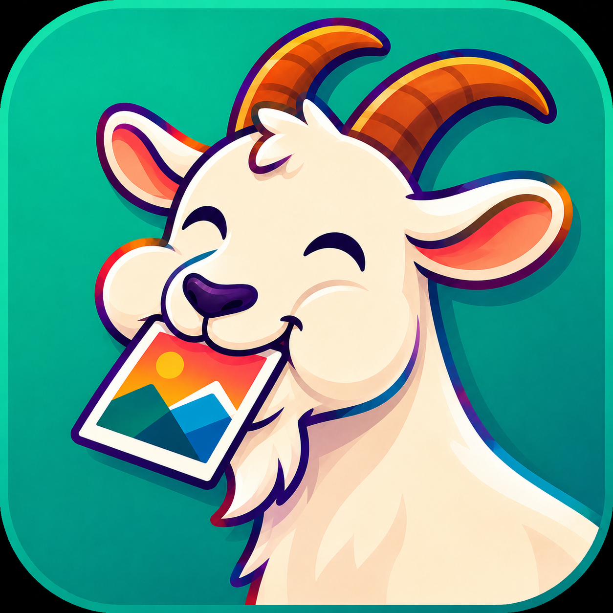

<p align="center">
  
</p>

# GOAT Gallery

**GOAT** means **Gallery Organizer & Auto-Tagger**: a fast, dense, customizable
gallery for large local media libraries.

It is built for people who keep a lot of images, GIFs and videos on their own
devices and want a viewer that feels personal, quick and practical instead of
generic. GOAT focuses on local files, local metadata, local tagging and a compact
interface that leaves as much room as possible for the media itself.

> GOAT does **not** provide, bundle or download any media content. It only
> organizes files that already belong to the user. Local models may classify
> mature/explicit images as part of private on-device tagging, but the app is a
> general media gallery, not a content source.

## Highlights

- **Dense virtualized grid** for very large libraries.
- **Images, GIFs and videos** in one library, with quick media-type filters.
- **Albums, folders and date views** for different browsing styles.
- **Full-screen viewer** with swipe navigation, zoom and file details.
- **Local auto-tagging** with ONNX models, designed to run on the device.
- **Manual tags, tag search, import/export and relinking** for moved files.
- **Favorites, safe trash and duplicate/corrupt-file tools**.
- **Custom themes and layout density** for desktop, tablet and phone screens.
- **Cloud-friendly thumbnails**: GOAT keeps its own thumbnail cache and can avoid
  downloading cloud-only originals just to draw the grid.
- **LAN sharing mode** for browsing media from another GOAT device on the local
  network.
- **Windows, Android and Linux builds** through GitHub Actions.

## Why This Gallery Exists

Most galleries are either pretty but slow, fast but plain, or designed around a
phone-first photo roll. GOAT is aimed at power users with big mixed collections:
art folders, screenshots, references, camera photos, videos, GIFs, downloaded
images, work-in-progress files and archived material.

The design goal is simple: open a huge library, scan it quickly, show thumbnails
without wasting memory, and make organizing thousands of files feel calm instead
of exhausting.

## How It Works

GOAT is a Flutter app with platform-specific media access where needed.

- On **Windows/Linux**, it scans user-selected folders recursively.
- On **Android**, it can use the system media library for photos and videos.
- The grid is virtualized, so only visible tiles are built.
- Thumbnails are decoded at reduced size instead of loading full originals.
- GOAT stores metadata such as tags and favorites locally.
- Auto-tagging uses local ONNX models; images are not sent to a server.
- Windows, Android and Linux packages are built automatically in GitHub Actions.

## Media Support

Supported library items include:

- Images: `jpg`, `jpeg`, `png`, `gif`, `webp`, `bmp`, `jfif`
- Videos: `mp4`, `m4v`, `mov`, `webm`, `mkv`, `avi`, `wmv`, `3gp`, `3gpp`
- Project previews: `kra`, `psd`

Project files are not edited by GOAT. When possible, the app extracts embedded
previews so they can appear in the gallery.

## Tagging And Privacy

GOAT is designed around private, local organization.

- Tags are stored in a local database.
- Tags can be edited manually.
- Tag databases can be exported/imported as JSON.
- Auto-tagging runs locally after the required model is downloaded.
- Classification may include general visual tags and rating-like labels when a
  model supports them.

No bundled model or feature changes the fact that GOAT is only classifying the
user's own files on their own device.

## Current Status

GOAT is in active development. The core gallery, real-file scanning, viewer,
themes, media filters, video playback, local tagging tools, duplicate tools and
cloud-aware thumbnail cache are already implemented. Performance work and the
tagging pipeline are still being refined for very large libraries.

The main target platforms are:

- Windows
- Android
- Linux

Apple platforms are technically possible with Flutter, but they are not the main
target at the moment because iOS/macOS builds, signing and photo-library access
need a separate Apple-specific workflow.

## Downloads

Builds are published from GitHub Actions / Releases:

- `GOAT-windows.zip` for Windows
- `GOAT.apk` for Android
- `GOAT-linux.tar.gz` for Linux

Latest releases are available on the repository releases page:

https://github.com/Darxarz/Capra/releases

## Development

The project is written in Flutter/Dart.

Important source areas:

```text
lib/
  main.dart             app startup and theme wiring
  home_page.dart        main gallery screen, sections, filters and grids
  viewer_page.dart      full-screen image/video viewer
  library_service.dart  local and Android media scanning
  preview_service.dart  project previews and thumbnail cache
  tag_service.dart      local tag database
  tagger_service.dart   local ONNX auto-tagging
  settings_page.dart    user-facing settings
  theme.dart            Aurora/GOAT color system

.github/workflows/
  build.yml             Windows, Android and Linux CI builds
```

---

# GOAT Gallery на русском

**GOAT** расшифровывается как **Gallery Organizer & Auto-Tagger**: быстрая,
плотная и настраиваемая галерея для больших локальных коллекций.

Она сделана для людей, у которых на устройстве много картинок, GIF и видео, и
которым нужна не очередная одинаковая галерея, а удобный личный инструмент:
быстрый просмотр, теги, папки, альбомы, избранное, аккуратный дизайн и минимум
лишнего интерфейса вокруг самих медиа.

> GOAT **не поставляет, не скачивает и не распространяет** никакой медиаконтент.
> Приложение работает только с файлами пользователя. Локальные модели могут
> классифицировать взрослый/explicit-контент как часть приватного тегирования на
> устройстве, но сама галерея является универсальным менеджером медиа, а не
> источником контента.

## Главные возможности

- **Плотная виртуализированная сетка** для очень больших библиотек.
- **Картинки, GIF и видео** в одной коллекции, с быстрыми фильтрами по типу.
- **Разделы “Все”, “По датам”, “Альбомы/папки”**.
- **Полноэкранный просмотрщик** со свайпами, зумом и информацией о файле.
- **Локальное авто-тегирование** через ONNX-модели.
- **Ручные теги, поиск по тегам, импорт/экспорт и перепривязка тегов**.
- **Избранное, безопасная корзина, поиск дублей и битых файлов**.
- **Темы, плотность интерфейса и настройки вида** для ПК, планшетов и телефонов.
- **Кэш миниатюр для облачных дисков**: GOAT может не скачивать оригиналы из
  OneDrive/Yandex/etc. только ради отрисовки сетки.
- **Локальная сеть**: можно подключиться к другому устройству с GOAT и смотреть
  его библиотеку по LAN.
- **Сборки под Windows, Android и Linux** через GitHub Actions.

## Зачем Она Нужна

Обычные галереи часто либо красивые, но медленные, либо быстрые, но слишком
простые, либо заточены только под телефонную фотоленту. GOAT рассчитан на
большие смешанные коллекции: арты, скриншоты, референсы, фото с камеры, видео,
GIF, скачанные картинки, рабочие файлы и архивы.

Цель GOAT: быстро открыть большую библиотеку, не декодировать гигантские
оригиналы в сетке, не забивать экран лишними панелями и дать нормальные
инструменты для организации тысяч файлов.

## Как Это Устроено

GOAT написан на Flutter и использует отдельные возможности платформ там, где это
нужно.

- На **Windows/Linux** приложение рекурсивно сканирует выбранные папки.
- На **Android** может читать системную медиатеку фото и видео.
- Сетка виртуализирована: создаются только видимые плитки.
- Миниатюры декодируются в уменьшенном размере.
- Теги, избранное и служебные данные хранятся локально.
- Авто-тегирование работает локально; изображения не отправляются на сервер.
- Windows, Android и Linux собираются автоматически через GitHub Actions.

## Поддерживаемые Файлы

GOAT видит:

- Изображения: `jpg`, `jpeg`, `png`, `gif`, `webp`, `bmp`, `jfif`
- Видео: `mp4`, `m4v`, `mov`, `webm`, `mkv`, `avi`, `wmv`, `3gp`, `3gpp`
- Превью проектных файлов: `kra`, `psd`

Проектные файлы GOAT не редактирует. Если внутри есть готовое превью, приложение
показывает его в галерее.

## Теги И Приватность

GOAT задуман как локальный приватный инструмент.

- Теги хранятся в локальной базе.
- Теги можно править вручную.
- Базу тегов можно экспортировать и импортировать в JSON.
- Авто-тегирование запускается локально после скачивания модели.
- Если модель умеет rating/NSFW-классы, GOAT может сохранить такие метки как
  часть локальной классификации.

Приложение не отправляет пользовательские изображения в облако ради тегирования.

## Статус

GOAT активно разрабатывается. Уже есть основной экран галереи, чтение реальных
файлов, просмотрщик, темы, фильтры по типу медиа, видео, теги, инструменты для
дублей, локальная сеть и кэш миниатюр для облачных дисков. Производительность и
конвейер авто-тегирования ещё будут улучшаться под очень большие библиотеки.

Основные платформы:

- Windows
- Android
- Linux

Apple-порт технически возможен, но сейчас не является главным направлением:
iOS/macOS требуют отдельной сборки на macOS, подписи Apple и другого доступа к
фотобиблиотеке.

## Скачать

Готовые сборки публикуются в GitHub Actions / Releases:

- `GOAT-windows.zip` для Windows
- `GOAT.apk` для Android
- `GOAT-linux.tar.gz` для Linux

Последние релизы:

https://github.com/Darxarz/Capra/releases
